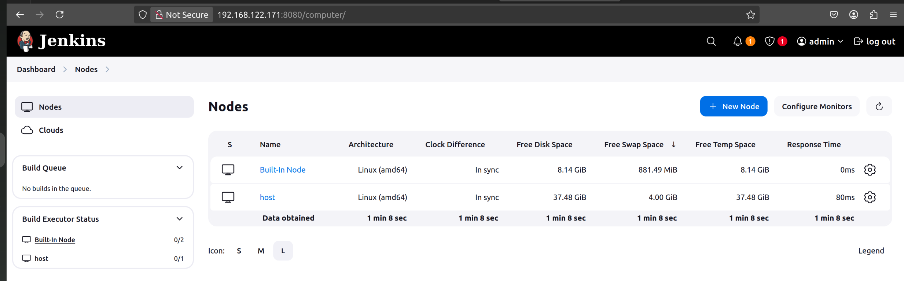
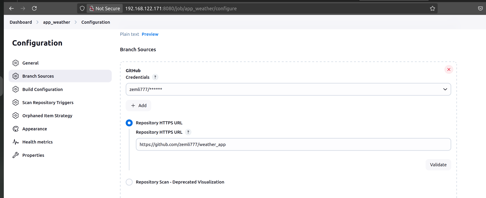

# Что нужно сделать:
1) Установить Jenkins на виртуальную машину;

  jenkins будем устанавливать на голую вм debian из под docker

  * Пропишем права sudo пользователю:

  ```bash
   nano /etc/sudoers
  ```

  * Настроим сеть:

  ```bash
   nano /etc/networking/interface
  ```

  * Обновим зеркала:

  ```bash
    nano /etc/apt/source.list
   ```

  * Обновим список пакетов:

  ```bash
    apt update
  ```

  * Установим docker:

  ```bash
    apt install docker docker-compose -y
  ```

  * [Установка Jenkins](https://www.jenkins.io/doc/book/installing/docker/)


2) Создать multibranch джобу/проект и настроить интеграцию с GitLab;

 * Подключим агента jnekins на хостовой машине

   

 * Создадим проект и настроим интеграцию с github

   Параметры интеграции с github
   

 но так тоже скучно, так что настроим webhook
[статья в помощь](https://habr.com/ru/companies/slurm/articles/721520/)


3) При коммите в репозиторий (вашу ветку), запускается автоматическая сборка Docker-образа вашего приложения и образ кладётся в Docker Hub.

загружать на докерхаб не интересно, поэтому вместо этого прогоним нашу програмку на поиск уязвимостей и линтер
Definition of Done:

1) В репозитории лежит Jenkinsfile;
2) В репозитории есть документация с описанием выполненной работы со скриншотами;

